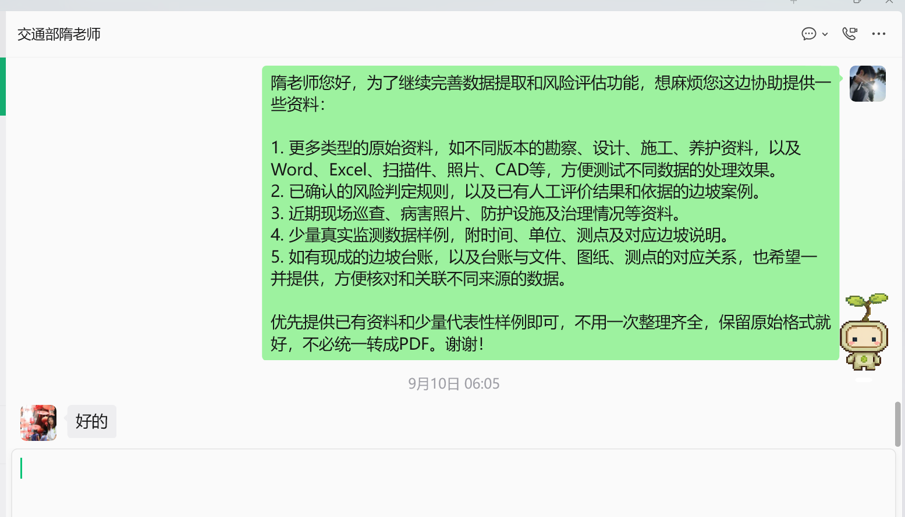

# SlopeKG 2026年9月进展报告

**统计区间：2026年9月1日至9月20日。重点周：9月14日至9月20日。**

本月已把已有资料的工程参数提取、证据追溯、风险复核排序和图片浏览进一步接通。最近一周重点完成来源问题清理、风险分项展示、545项图片资产入图、两个文字识别漏项修复及页面交互回归。当前系统可支撑资料查询、历史工况筛查和人工复核排序；正式风险等级、失稳概率及实时预警仍未形成。

**现在要做什么：**可直接使用本报告汇报阶段成果。下一步优先扩大独立核对样本，确认原文歧义，并协调带日期的现场资料、专家风险标签和目标运行环境。文中的下一步是工作建议，不构成新增对外承诺。

## 1. 统计依据与口径

本报告核对了本地唯一项目台账的总览、收件箱和正式计划跟踪，并详细查看提取、OCR、图谱、风险、人工补录、多模态、接口、导出、前端及相关测试代码。月度归属按已确认的项目进度口径确定，周内时间以阶段记录和成果快照为依据，能力判断以代码与测试为依据。

- **月度统计以7月30日版本为基线：8月无须单列的项目进展，7月30日之后截至本报告截止日的全部项目增量统一计入9月。**基线提交为 `0986b9212eaff07d952867cba6f73adc882f1125`。这包括当时尚未逐次提交的代码、测试、功能和成果改进，不再将其列为月份待定事项。提交次数不用于推算工作量。
- 9月9日、9月15日有阶段说明；9月15日有带文件校验清单的成果归档；9月20日有本地优化记录及当前成果。本报告据此描述阶段变化，未编造逐日进度。
- **9份PDF、651页在7月30日版本中已经存在。**它们是本月处理的资料范围，不是本月新增资料量。
- 当前活动结果为 `basic` 基础层，即本地确定性提取结果；7月提交中的活动结果为 `deep` 深度层，即包含大模型语义候选的结果。两层节点数不能直接作为质量提升的同比指标。
- 当前图谱、目录、风险结果生成于9月20日15:22左右；本次报告整理重新执行测试及局部评测。没有重新运行整库OCR，也没有调用外部大模型。
- 台账和本地工作规则不随报告上传；按用户要求，本报告附9月10日资料需求沟通截图，其余沟通原文保留在本地。正式计划状态按台账保留，不把功能完成等同于里程碑验收完成。

当前指标与复测结果见[机器可读证据摘要](reports/2026-09-20/progress-evidence.json)，核查文件及SHA-256（文件内容校验值）见[来源清单](reports/2026-09-20/source-manifest.json)。

## 2. 本月工作概况

| 工作方向 | 本月可核实进展 | 对项目的实际作用 | 当前边界 |
|---|---|---|---|
| 工程资料提取 | 新增材料参数和稳定性工况表格的结构化提取；56张相关表、254个材料参数值、38条表格工况结果 | PDF里的参数可以查询、关联和回查原页 | 提取历史计算结果不等于重新计算稳定性 |
| 图谱质量 | 路线与标准化桩号共同识别边坡；保留来源冲突；排除1条起止里程异常记录 | 有效边坡从63个候选收敛为62处，减少错误归属 | 异常原文仍待工程人员确认 |
| 扫描及图纸识别 | 7月30日基线的410个待处理OCR任务在9月完成；截至9月15日已有完成记录，9月20日进一步修复短标签拼接和标题栏漏识别 | 扫描文字、图纸标题和原页证据能够进入结构化流程 | 未建立全库字符级或字段级准确率 |
| 风险复核 | 将静态关注、近期异常、暴露后果与综合复核顺序分别展示；补充时间有效性、冲突检查与发布条件检查 | 明确“哪里值得优先核查”和“还缺什么” | 仍是P1—P4复核顺序，无正式风险等级 |
| 人工补录和规则 | 9月新增独立补录层、动态字段日期校验、规则字段与运算符白名单、审核启用状态、操作记录 | 人工修订可保留，重新解析PDF时不覆盖补录 | 功能已实现；具体工程输入和规则仍需审核 |
| 图片及多模态资料 | 545项PDF派生图片建立目录、来源校验、图谱关联和浏览页面 | 可以按文档、页码、类型、核对状态检索并回查PDF | 全部是PDF派生视觉资料，真实空间资产为0 |
| 交付与验证 | 局部评测脚本、成果归档、离线HTML和自动测试完善 | 成果可检查、复跑和离线展示 | 尚未进行最终目标机器验收 |

可对照[9月9日工程表格优化说明](PDF计算资料提取优化与缺口复核_20260909.md)和[9月15日阶段成果说明](阶段成果说明_20260915.md)。后者是历史截面，其中38/40页内事实命中等数值已被本报告的9月20日结果更新，不应混用。

月度增量与存量分开统计：410个OCR任务由待处理转为完成、工程表格结构化、人工补录、风险分项研判、图片目录与入图、交互修复和新增测试均计入9月。7月30日前已有的9份PDF、651页资料及164条规则候选、22张阈值表、2个公式继续作为项目存量，不重复计作本月新增。月度归属已经明确，但没有周内证据的工作不全部归入最近一周。

### 2.1 资料协调进展与外部输入依赖（9月21日补记）

**开发方已完成资料需求梳理并向交通部对接联系人发出索取说明。**索取范围包括五类：多类型原始资料及原生格式样例；已确认的风险规则与人工评价案例；近期巡查、病害照片及治理情况；带时间、单位、测点和边坡说明的真实监测样例；现有边坡台账及文件、图纸、测点对应关系。沟通中已明确可先提供已有资料和少量代表性样例，保留原始格式，无需一次整理齐全。

对方已作简短确认回复，但未在所示沟通中明确提供清单、交付日期或分批安排。根据9月21日补充的项目状态，所需补充资料仍未收到。**本月应计入已完成的协调进展是“资料需求已提出、已向对接方说明”；当前状态是“已索取，等待资料提供方交付”。**下图证明已提出资料需求及对方已回复“好的”；后续未交付资料的状态依据9月21日补充信息，不能单凭这张截图证明对方一直没有回复。

*图：资料需求已提出；截至9月21日补充状态，所需资料仍待提供。*

| 已完成的开发方工作 | 仍待资料提供方落实的输入 | 对后续工作的影响 |
|---|---|---|
| 列明资料类型、用途及优先提供少量样例的方式 | 多格式原件和代表性样例 | 新格式与复杂页型实料验证暂缺输入 |
| 提出已确认规则和人工评价案例需求 | 规则适用条件、评价结果及其依据 | 正式风险规则审核及独立效果评测仍受资料约束 |
| 提出近期巡查、病害照片及治理情况需求 | 带对象与日期的现场资料 | 近期异常和治理状态无法据实验证 |
| 提出真实监测样例及对象映射需求 | 时间、单位、测点与边坡对应的数据 | 真实时序接入、趋势与动态规则验证待样例 |
| 提出现有台账及文件、图纸、测点对应关系需求 | 主台账与对应关系 | 跨来源归属和测点关联仍需外部依据 |

资料整理、可提供范围确认和交付安排需要由资料提供方落实；开发方继续推进现有资料范围内的提取优化、测试与接口准备，收到样例后负责校验、接入和结果复核。依赖尚未交付资料的验证应标记为外部输入受阻，不记作开发方尚未提出需求或尚未开展协调。

## 3. 最近一周重点进展

### 3.1 资料与图谱质量核验

9月15日阶段归档已确认9份文档、651页基础解析结果。按现有页面分类统计：原生文本47页、表格190页、扫描75页、图纸329页、混合7页、空白3页。解析得到248个表格对象，其中56张识别为材料参数或稳定性计算相关表格。

边坡归属以“路线编号＋标准化桩号区间”为基础。对起点大于终点的来源记录保留问题说明，不再创建错误边坡节点。当前5条路线共62处有效边坡，其中59处具有多来源资料。

两个关键工程问题保持可追踪：

1. G347报告第14页的推荐材料参数属于项目或文档层面，未默认分配给附近某一处边坡，也不直接驱动风险筛查。
2. G351报告第44页存在表题桩号与章节不一致、表格与正文稳定状态不一致的问题。程序保留原文与待核验标记，限制相关结果进入筛查；第5页异常桩号继续保留待确认。

当前1285条属性断言中1236条有证据，覆盖率96.19%。这里的“断言”就是一条结构化事实；此比例衡量是否保留证据，不表示事实正确率。本次从活动图谱重新计数，重复节点ID、悬空关系、孤立节点均为0。

### 3.2 风险研判按不同问题分别给出结果

9月15日的风险升级已落实到计算代码、在线页面和离线HTML，详见[多轴升级说明](风险研判多轴升级说明_20260915.md)。“多轴”在这里就是分别回答四个问题：历史资料支持多大关注、近期有无异常、可能影响什么对象、应先复核谁。

- 支持滑坡、崩塌/危岩/落石、泥石流和路基变形的资料检查清单。当前数据并不代表四类灾害都已完成验证。
- 人工动态补录必须有日期。默认0—30天为近期，31—90天提示复核，超过90天转作历史证据。这是项目的数据时效策略，不是工程预警阈值。
- 对同一对象、断面和工况下的不一致稳定性记录提示冲突，保留最不利记录用于保守排序，并限制正式结论。
- 正式发布条件检查包括已审核规则、危险性或关注依据、暴露后果、近期证据、审核后的动态规则结果及未解决冲突。
- 独立风险评测模块支持复核顺序一致率、相邻顺序一致率、P1/P2重点对象召回率与精确率、P1严重漏判数。没有专家标签时返回“不可评测”，不生成虚构准确率。

当前62处边坡的复核顺序仍为 **P1 22处、P2 5处、P3 33处、P4 2处**。静态关注分别为较高27处、中等12处、一般10处、资料不足13处。62处的近期动态状态、暴露后果均无法判断，正式风险等级数量为0。

### 3.3 两个文字识别漏项修复并扩充回归样本

9月15日原固定样本为8页、40项关键事实，命中38项。9月20日对应实现增加了两类处理：

- 保留原OCR文本框，对同一图片中紧邻、居中、行高相近的中文短标签产生拼接候选，并保留组成文本框ID；不跨页拼接，也不把数值单元格强行合并。
- 图纸标题栏裁剪覆盖完整底部区域；对纵向编码的横向图纸设置旋转方案。缓存名称区分裁剪区域和版本，避免沿用旧的缺字截图。

原有40项现在全部命中；另增加3页15项样本，形成11页55项固定回归集，覆盖9份PDF。新增3页明确标为AI原页核对，尚未经独立人工复核。**55/55是内部固定样本命中结果，不是全库准确率。**

本次重新执行页面评测得到11/11页、55/55项通过；工程表格评测保持9组用例、76/76条记录正确，关联与问题标记也全部通过，未放宽原对照标准。

### 3.4 545项图片资料与图谱、页面接通

当前目录包含545项视觉资产：130项整页图、411项图纸标题栏、4项PDF局部图。“资产”在这里指带来源和校验信息的一个图片文件，不代表新增545个独立工程对象或545个独立页。

主流程现在自动更新目录，并把校验通过的图片加入“来源文档—图片—来源页”关系。检查覆盖文件存在性、图片解码、文件内容校验、页码、文档指纹、边坡编号和重复资产ID。坏元数据单独报告，不影响其他资产盘点；有错误的资产不入图。重复接入会替换目录管理的旧节点，避免累计重复节点。

545项均已关联来源文档，目录错误数为0；545个视觉节点已进入图谱。具体边坡归属的已审核数量仍为0，程序没有根据文档归属自动猜测边坡归属。只有有效边坡编号并且明确标记审核通过，才建立正式边坡关联。

新增图片资料页支持文档、页码、类型、状态、关键词筛选，提供分页、图片预览、PDF原页链接和目录问题列表。9月20日后续修复了刷新时筛选和页码丢失、来源文档名可显示却搜不到的问题，并增加7项真实浏览器回归测试。本次7项全部重跑通过。

### 3.5 展示和离线交付保持可用

当前活动图谱包含1689个节点、2831条关系。与9月15日归档的1141个节点、1738条关系相比，净增548个节点、1093条关系，其中545个是视觉资产节点；不能把全部增长都说成新增边坡知识或全部归因于图片。

图谱离线HTML保留全部545个视觉节点，文件为2,052,094字节，约1.957 MiB。风险离线HTML为846,346字节，约0.807 MiB。导出通过去掉视觉关系中与资产节点重复的来源字段缩减体积，机器可读图谱保留完整字段。

离线HTML可以浏览内嵌图谱或风险数据，但没有内嵌全部原始图片。图片浏览和PDF原页跳转需要本地文件及服务；这部分不应描述为完整的单文件图片交付。

## 4. 截至9月20日的指标

| 指标 | 当前结果 | 解读 |
|---|---:|---|
| 资料范围 | 9份PDF、651页 | 存量资料规模；不是9月新增量 |
| 已完成OCR任务 | 410/410 | 保存的任务结果，设备记录为GPU；本次未整库重跑 |
| 有效边坡 | 62处 | 63行来源记录中1条异常区间未作为有效实体 |
| 工程相关表格 | 56张 | 55张有关联，1张保留为文档级参数表 |
| 材料参数值 / 表格工况结果 | 254 / 38 | 为提取数量，不能当成准确率或独立边坡数 |
| 活动图谱节点 / 关系 | 1689 / 2831 | 含545个视觉节点；活动层为basic |
| 属性证据覆盖 | 1236/1285，96.19% | 衡量证据保留情况 |
| 重复ID / 悬空关系 / 孤立节点 | 0 / 0 / 0 | 本次重新计数通过 |
| 页面内部回归 | 11页，55/55项 | 3页为AI核对，待独立人工复核 |
| 工程表格内部回归 | 9组，76/76条 | 6个原始页面；不代表全库或工程结论正确率 |
| 图片文件 / 已关联文档 | 545 / 545 | 均为PDF派生视觉资料 |
| 图片具体边坡归属已审核 | 0 | 尚需审核关联 |
| 真实空间资产 | 0 | 尚无遥感、点云、三维模型实数验证 |
| 已保存规则候选 / 阈值表 / 公式 | 164 / 22 / 2 | 7月已有库存；不计入9月新增成果 |
| 已审核规则 / 专家风险评测样本 | 0 / 0 | 无法报告正式风险准确率 |
| 本地Python测试 / 浏览器测试 | 118通过 / 7通过 | 本次重跑结果；Python全通过依赖本地资料 |
| 仅使用暂存文件的Python测试 | 115通过 / 2失败 / 1错误 | 3项依赖未上传的本地输入，详见下文 |
| 内部质量检查 | 11/13项通过 | 坐标与治理字段覆盖两项仍未达标 |

治理字段需区分口径：自动提取评测中的`treatment`覆盖13/62处，图谱中的防护设计关系覆盖18/62处。两者定义不同，不能互相替代。测量控制点保留13组，但不能当成边坡起止坐标；当前边坡端点坐标覆盖仍为0/62。

## 5. 代码核查与验证记录

本次不仅阅读说明文档，还沿实际调用链检查了数据如何进入图谱、哪些输入被排除、哪些结果可展示。下表列出核查重点，便于后续复核。

| 代码入口 | 已核查的实现 | 对应验证 |
|---|---|---|
| [engineering.py](../src/slopekg/engineering.py) | 按表头提取材料、天然/饱和工况、单位和数值；根据章节及版面找归属；保留表题和正文冲突；新增未审核工况不自动筛查 | 工程表格测试、76条原页对照 |
| [extractors.py](../src/slopekg/extractors.py)、[graph_builder.py](../src/slopekg/graph_builder.py) | 路线/桩号身份、控制点与端点区分、材料参数节点、工况证据、视觉节点去重及审核关联 | 发现、图谱结构、工程与资产集成测试 |
| [ocr.py](../src/slopekg/ocr.py) | 设备选择、并发渲染、批量识别及失败后的逐页尝试、标题栏裁剪、短标签候选拼接 | OCR运行逻辑测试、页面回归；本次未验证整库GPU吞吐 |
| [risk.py](../src/slopekg/risk.py)、[risk_evaluation.py](../src/slopekg/risk_evaluation.py) | 静态/动态/后果分离、时间处理、同工况冲突、正式发布门槛、无标签不可评测 | 风险筛查及独立评测测试 |
| [manual.py](../src/slopekg/manual.py) | 补录覆盖层、日期要求、规则白名单、启用条件与操作记录 | 人工补录流程测试 |
| [multimodal.py](../src/slopekg/multimodal.py)、[pipeline.py](../src/slopekg/pipeline.py) | 文件级目录、校验、来源文档关联、主流程自动刷新；空间字段仍为接入契约 | 多模态与资产集成测试 |
| [server.py](../src/slopekg/server.py) | 新增补录/风险评测/多模态接口；公开静态目录限制；有Origin的写请求校验 | 上传与路径/来源限制测试；不等同于完整安全审计 |
| [assets.js](../web/assets.js)、[portal.js](../web/portal.js)、[rules.js](../web/rules.js) | 图片筛选与刷新、来源名搜索、工程参数/风险展示、人工规则交互 | 图片浏览器7项回归、脚本语法检查 |
| [exporter.py](../src/slopekg/exporter.py) | 活动补录层导出及视觉来源字段压缩，保留节点和关系 | 两类离线导出测试 |
| [rebuild_from_sidecars.py](../scripts/rebuild_from_sidecars.py) | 复用已解析逐页结果前核查PDF清单与指纹；重新验证缓存语义，不调用API | 缓存及分层流程测试；本次未执行完整重建 |

本次实际验证：

1. `python -m unittest discover -s tests -q`：118项通过，约10.25秒。
2. `node --test tests/browser/assets.test.cjs`：7项通过，0失败、0跳过。测试使用隔离模拟目录，验证真实浏览器交互，不代替对545张真实图片逐张人工检查。
3. `python scripts/evaluate_page_extraction.py --output .tmp/progress-20260920/evaluation_pages.json`：11/11页、55/55项。
4. `python scripts/evaluate_engineering_extraction.py --output .tmp/progress-20260920/evaluation_engineering.json`：9/9组、76/76条。
5. 对活动图谱重新计数，核对节点唯一性、关系两端存在性和孤立节点。

页面与表格复测保存为[页面评测结果](reports/2026-09-20/evaluation_pages.json)和[工程表格评测结果](reports/2026-09-20/evaluation_engineering.json)。使用已有`slopekg`环境和已有浏览器运行时，未安装或修改环境依赖。临时使用`PYTHONPATH`加载源码、`PYTHONIOENCODING`保证中文输出、`NODE_PATH`定位Playwright。没有使用密钥发起API调用；独立快照中的密钥优先级测试读取了已有`DEEPSEEK_API_KEY`环境变量，仅检查读取来源，未输出密钥值。

**另行检查暂存快照的可复现性：**将实际待提交文件导出到独立目录，运行同一套118项Python测试，结果为115项通过、2项失败、1项错误。这3项依赖本地输入，不能将原工作区118/118宣称为“任意GitHub检出都能全部通过”。

| 受影响测试 | 独立目录中的结果与原因 | 后续建议 |
|---|---|---|
| `test_catalog_searches_nested_source_directories` | 找不到本地嵌套目录中的JTG C20-2011规范，产生1项错误 | 后续将目录发现测试改为自建临时样本 |
| `test_project_secret_has_priority_and_is_not_exposed_by_status` | 无项目密钥文件，读取来源回退到环境变量，与测试固定预期不符 | 后续用虚构密钥和隔离临时文件验证优先级，避免依赖真实配置 |
| `test_document_inventory_reports_raw_pdfs` | 未上传原始PDF，目录计数为0，与测试至少1份的预期不符 | 后续使用测试PDF样本或将实料检查单独标识 |

本次任务为核查、报告与归档，保留现有测试实现并如实记录上述限制；没有通过补传私有资料或放宽断言来取得通过结果。

## 6. 正式计划对应状态

以下为9月20日本地正式计划跟踪状态的摘要。原正式计划日期与成果条款保持不变；计划日期不代表已验收。

| 计划项 | 对应任务 | 当前状态 | 本月支撑及剩余条件 |
|---|---|---|---|
| P-01 | 提取评测基线 | 部分完成 | 内部样本已扩充；独立人工覆盖仍不足 |
| P-02 | 多类文档解析优化 | 进行中 | 表格、OCR及图片链路完善；复杂页型继续扩样 |
| P-03 | 影像及空间资料关联 | 部分完成 | PDF图片文件级链路可用；真实空间数据待到位 |
| P-04 | 监测时序导入 | 等待资料 | 缺代表性时序及测点—边坡映射 |
| P-05 | 标注数据接入 | 等待资料 | 缺标签定义、专家证据和独立测试集 |
| P-06 | 专家规则管理 | 部分完成 | 候选管理及启用条件具备；已审核规则为0 |
| P-07 | 物理计算方法 | 等待资料 | 已提取参数和历史Fs；具体方法、完整算例未齐 |
| P-08 | 模型选型与适配 | 进行中 | 任务级工具基础具备；统一评测、成本和部署条件待补 |
| P-09 | 模型训练与智能体原型 | 等待资料 | 依赖标签、发布规则和可验证计算工具 |
| P-10 | 独立风险验证 | 受阻 | 程序有评测入口，专家风险金标准仍为0 |
| P-11 | 图谱专项核验 | 部分完成 | 结构问题清理与图片入图完成；事实独立核对需扩充 |
| P-12 | 对齐、冲突及时间区分 | 进行中 | 已有身份与冲突处理；原文确认尚未闭环 |
| P-13 | 系统联调 | 进行中 | 图谱、目录、图片页、风险及导出已联通；实数接口仍缺 |
| P-14 | 封装与技术文档 | 进行中 | 本地测试及离线交付可用；目标机器未验收 |
| P-15 | 试用整改与验收 | 未开始 | 待候选交付版本和实际试用反馈 |

因此，15项正式计划均尚未达到整项完成状态。不能据局部测试通过计算一个未经定义的“项目完成百分比”。

## 7. 未完成事项与下一步

| 优先级 | 下一步建议 | 可检查的完成标准 | 依赖 |
|---|---|---|---|
| 优先 | 扩大页面、字段及视觉归属的独立核对集 | 标明核对人、来源、页码、字段及错误类型；区分AI与人工样本 | 独立人工复核 |
| 优先 | 确认G351来源歧义 | 留下原文、确认版本和纠正记录，再更新实体或筛查输入 | 原设计/勘察依据或工程人员确认 |
| 优先 | 确认当前“风险预测”的验收含义 | 明确接受的是复核排序、等级、概率还是预警；不混用指标 | 项目范围及验收确认 |
| 后续 | 接入少量近期巡检、监测、降雨及暴露资料 | 每条记录具有对象、日期、单位、质量标记和来源 | 数据样例及对象映射 |
| 后续 | 完成一批规则审核与一种物理计算对照 | 先明确适用条件、单位、边界和完整算例，再验证结果 | 指定专业审核与算例 |
| 后续 | 验证真实空间数据 | 文件、坐标系、时间、覆盖范围和边坡关联均可检查 | 遥感/点云/三维模型原始文件 |
| 后续 | 在约定目标环境验收 | 安装、启动、导入、查询与报告生成完成记录 | 目标硬件和联网限制 |

图谱节点增加、样本满分和测试通过都不能替代上述资料及工程确认。当前主要制约已从“能否显示一张图”转向“输入是否可靠、事实能否核实、风险结果如何验收”。

## 8. GitHub归档范围与使用说明

本次整理采用独立分支 `codex/september-progress-20260920`，以7月30日提交为代码基线，归档当前已有源码、前端、测试、运行配置、9月阶段说明、本报告及对应的结构化和离线展示结果。本次整理没有新增业务算法或代替工程人员修订原始事实。

- [图谱离线HTML](../output/demo/share/SlopeKG_成果展示_离线版.html)与[风险离线HTML](../output/demo/share/SlopeKG_风险研判_离线版.html)下载后可本地打开。
- 当前结构化数据、OCR文字结果和图片目录随代码归档，便于核对本报告指标。
- 原始PDF、本地台账、除本报告所附截图外的沟通原文、密钥、临时构建文件、完整历史归档和本轮新增的批量图片缓存不上传。仓库已有图片保持原有跟踪状态，因此GitHub检出不包含完整545张图片。需要真实图片预览时，须在有原始资料的本地环境恢复对应图片文件；快照中的文件检查结论属于本次本地验证，不能当成新机器检查结果。
- 新机器运行测试须先具备Python依赖；浏览器测试还需要Playwright和可用浏览器。当前Python测试还有上述3项本地输入依赖，纯GitHub检出尚不能全套通过。数据或环境不齐时，应区分代码回归、图片预览和工程验收，不能仅凭启动成功宣布交付完成。
