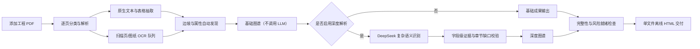

# SlopeKG 公路边坡风险知识图谱阶段性成果与后续需求报告

**报告日期：** 2026年7月18日  
**当前阶段：** 基础/深度双层自动解析、证据约束知识图谱、离线成果交付与风险研判就绪检查 Demo  
**适用范围：** 当前仓库中的 G209 示例资料及后续按同一流程新增的 PDF 工程资料

## 1. 报告目的

本报告用于说明 SlopeKG 当前已经形成的成果、现阶段能够完成的工作、仍然存在的技术与数据边界，以及下一阶段需要交通部研究院确认或提供的业务需求、数据资料和验收标准。

当前系统的定位是：以“边坡”为核心对象，自动接入工程 PDF，逐页解析并抽取有证据来源的边坡属性、地质条件、防护工程和稳定性分析信息，形成可查询、可追溯的基线知识图谱，为后续风险研判 Agent 提供结构化数据基础。

当前版本尚不等同于正式风险评估系统。它已经能够检查某个边坡是否具备风险研判所需的数据条件，但在正式风险规则、近期动态数据和审核流程确定之前，不直接给出正式风险等级。

## 2. 当前总体成果

目前已经形成一条不依赖人工种子的自动化处理链路，并正式拆分为“基础解析”和“深度解析”两层。基础解析不调用大模型，可独立完成逐页解析、确定性属性抽取、证据定位和基础图谱构建；深度解析在基础结果之上可选调用 DeepSeek，补充跨句语义、复杂关系和章节缺口，不覆盖基础产物。人工复核可以用于纠错和验收，但不是每次运行的前置条件。

### 2.1 PDF 自动接入与任务管理

已经新增独立的“PDF解析”页面，支持：

- 拖拽或批量选择 PDF；
- 仅上传、上传后立即解析、重新解析全部资料；
- 分别启动“基础解析”和“基于基础结果的深度解析”；
- 上传进度和后台处理进度展示；
- 按“逐页解析、OCR、属性抽取、语义识别、图谱构建、结果写入”展示真实阶段；
- 页面关闭后后台任务继续运行，重新打开页面可恢复最近任务状态；
- 显示每份 PDF 的解析状态、页型分布、文本块、表格和 OCR 队列；
- 校验文件扩展名、PDF 文件头和文件大小；
- 同名文件自动改名，避免覆盖原始资料；
- 防止多个图谱生成任务同时写入结果。

上传的原始 PDF 位于项目原始资料目录，该目录已从 Git 提交范围中排除。

### 2.2 按页自适应解析

系统不对全部页面统一使用 OCR，而是根据每页实际情况选择处理策略：

| 页面情况 | 当前处理策略 |
|---|---|
| 存在有效文本层 | 优先提取原生文本和版面坐标 |
| 表格页 | 原生版面解析与表格抽取 |
| 扫描页 | 进入整页 OCR 队列 |
| 工程图纸 | 提取已有文本；文字不足时进入标题栏 OCR 队列 |
| 图文混合页 | 合并原生文本与按需 OCR 结果 |
| 空白页 | 显式标记并跳过 |

所有原生文本块保留页码和边界框坐标，便于后续从图谱事实回溯至 PDF 原文位置。

### 2.3 自动信息抽取

当前已实现两层相互独立、可组合的抽取方式：

1. **基础解析/确定性抽取：** 不依赖大模型，适合桩号、坐标、坡长、坡高、坡度、治理措施、安全系数等格式相对稳定的字段，并独立生成基础图谱。
2. **深度解析/大模型辅助抽取：** 以基础解析产物为输入，适合灾害机理、岩性地层描述、结构面、影响因素、变形现象、水文现象、防护状态和多工况稳定性等跨句复杂语义。

大模型结果不会未经检查直接写入图谱。系统要求模型返回原文页码和逐字引句，并对引句、字段结构及事实支撑关系进行程序校验。证据关系已经从“一个边坡共用一条证据”细化为字段级绑定；系统还会检查变形、水文、防护、稳定性和结构面等章节是否存在“原文有提及但字段为空”的情况，并按缺口执行定向补充抽取。只有通过校验的候选内容才进入深度图谱；未通过的内容会保留为失败记录或缺失项。

基础图谱与深度图谱分别保存，既保证不调用大模型时系统可以完整运行，也便于比较大模型增强前后的差异。DeepSeek 输出上限已集中配置为当前接口允许的最大值，避免复杂章节因输出长度不足被截断。

### 2.4 边坡中心知识图谱

当前图谱以 `Slope` 为核心节点，不把所有字段都机械地建成实体。稳定且仅描述单个边坡的简单值保留为边坡属性；具有独立身份、多个属性、时间变化、复用关系或证据关系的内容建成独立节点。

已经落地的主要节点包括：

- 项目、路线段、边坡、资料文档；
- 灾害体、灾害类型、易感性评价、影响因素；
- 岩性、地层、结构面；
- 防护类型、防护工程；
- 地形地貌、变形现象、水文现象；
- 既有防护、建议/设计防护及其状态；
- 天然、暴雨、治理前后等多工况稳定性分析；
- 文档证据和属性断言。

已经形成的主要关系包括项目包含路线段、路线段包含边坡、边坡记录于文档、边坡具有岩性/地层/结构面/地形地貌、包含灾害体、受影响于某因素、具有变形与水文观测、具有既有防护或防护设计、具有稳定性分析等。节点、关系和属性断言均可连接至相应字段的文档证据。

### 2.5 属性数据字典与缺失语义

系统已接入交通部研究院反馈后的边坡属性数据字典 v0.2，完成了临河关系、植被情况、防护设施分类、隆起、管涌/渗水、设施损毁、总体变形严重程度和监测占位字段的配套调整。

系统明确区分以下状态：

- 已有有效数据；
- 明确不存在；
- 未知；
- 尚未观测；
- 不适用；
- 数据接口已预留但尚未接入。

因此，前端显示“缺失”或接口返回空数组，只表示当前系统没有有效数据，不能解释为现场不存在相应现象。

### 2.6 前端与接口

当前前端已拆分为多个独立页面：

- 项目总览；
- PDF 解析与信息提取；
- 边坡档案；
- 关系图谱；
- 数据完整性与接口状态；
- 风险研判就绪检查。

后端已经提供 PDF 上传、文档清单、后台任务进度、图谱、边坡档案、属性字典、Schema、完整性报告、抽取结果、证据断言和质量评测等接口。监测、环境、养护、巡检、暴露对象和风险规则接口已经预留，但尚未连接正式数据源。

### 2.7 单文件离线成果交付

系统已支持将当前基础图谱、深度图谱或当前图谱导出为一个自包含 HTML 文件。图谱数据、边坡档案、证据、完整性报告、样式和交互脚本均嵌入 HTML，不依赖项目目录、Python、数据库、后台服务或外部网络资源，可直接发送给交通部研究院并使用 Chrome/Edge 打开。

项目总览页面已增加“导出离线成果”功能，支持：

- 自定义导出文件名；
- 选择基础图谱、深度图谱或当前图谱；
- 生成后自动下载并保留再次下载链接；
- 自动过滤 Windows 非法文件名字符和路径穿越内容；
- 每次解析流水线完成后自动刷新默认离线成果文件。

当前默认离线成果约 600 KB，包含成果总览、边坡档案、交互图谱、证据和数据质量四个展示界面。为控制文件体积，文件内包含证据文字、来源文件名和页码，但不嵌入完整原始 PDF 和 OCR 页面图片。

## 3. 当前数据与运行结果

当前原始资料目录中包含 4 份 PDF，共 265 页。其中两份 G209 工程资料是当前边坡实例图谱的主要事实来源；地质灾害评估规范和滑坡分类资料主要作为规范、分类和方法参考，不应与具体边坡现场事实混用。

截至 2026年7月18日，最近一次深度图谱结果如下：

| 指标 | 当前结果 |
|---|---:|
| PDF 文档 | 4 份 |
| 解析页数 | 265 页 |
| 原生文本与 OCR 文字块 | 3,946 个 |
| 抽取表格 | 108 个 |
| 按页 OCR 任务 | 185 个（已实测完成 1 页，得到 22 条文字；其余 184 页待全量执行） |
| 自动发现候选边坡 | 13 个 |
| 图谱节点 | 275 个 |
| 图谱关系 | 405 条 |
| 图谱证据 | 181 条 |
| 有证据的属性断言 | 399 条 |
| 结构面节点 | 49 个 |
| 防护工程节点 | 52 个 |
| 稳定性分析节点 | 55 个 |
| 变形现象节点 | 20 个 |
| 水文现象节点 | 15 个 |
| 重复节点编号 | 0 |
| 悬空关系 | 0 |
| 孤立节点 | 0 |

当前主要字段自动覆盖情况：

| 数据项 | 覆盖率 |
|---|---:|
| 边坡清单 | 100% |
| 坐标 | 100% |
| 治理措施 | 100% |
| 几何信息 | 84.62% |
| 岩性 | 100% |
| 地层 | 100% |
| 多来源关联 | 100% |
| 属性断言证据关联 | 100% |

大模型共形成 13 条边坡语义候选，13 条通过当前程序校验；进入当前深度图谱的结果保留了 116 条已核验原文引句。程序会删除没有有效字段支撑的引句和事实，因此当前入图候选的引句及字段证据覆盖率均为 100%。该指标表示“进入图谱的事实均有可定位证据”，不等同于模型对原文所有事实的召回率或真实业务语义准确率达到 100%。真实精确率、召回率和 F1 仍需要独立人工金标准进行抽样审计。

本轮针对 K2412+602—K2412+664 等边坡进行了原文回查。系统已同时保留勘察报告中的天然工况稳定系数 1.14、暴雨工况稳定系数 1.04，以及设计表中的治理设计系数 1.237、1.131，并分别绑定到相应 PDF 页码和来源类型，避免将现状工况、暴雨工况和治理设计工况混为一条结论。

## 4. 当前质量评价

### 4.1 已达到的质量基础

- 生产运行不依赖人工种子；
- 13 个边坡桩号语法有效且互不重复；
- 所有当前图谱关系均指向有效节点；
- 当前没有孤立节点和悬空关系；
- 自动属性断言均保留证据引用；
- 大模型输出具有结构、引句和字段支撑校验；
- 已建立自动回归质量门，当前 11 项内部质量门全部通过；
- 现有自动化测试共 30 项，均已通过；
- 基础图谱与深度图谱独立保存，深度解析不会覆盖基础结果；
- 单文件离线 HTML 不包含外部脚本、样式或网络请求，也不包含大模型密钥；
- DeepSeek 项目密钥未写入源代码，并由 Git 忽略的项目密钥文件读取。

### 4.2 仍需优化的问题

1. **OCR 已打通但尚未完成全量运行。** 当前识别出 185 个按页 OCR 任务，已修复 PaddleOCR v3 返回结构、模型缓存权限和 CPU oneDNN 兼容问题；单页实测已成功得到 22 条文字。其余 184 页尚未全量执行，仍需评估总耗时、识别质量、资源占用及失败重试策略。
2. **真实准确率尚未被独立测量。** 当前指标主要反映覆盖率、结构完整性和证据一致性，不能替代按人工金标准计算的字段精确率、召回率和实体关系准确率。
3. **样本类型仍然有限。** 当前主要实例数据来自同一路段的两份 G209 工程 PDF，尚不足以证明对其他路线、其他设计单位、扫描报告、不同表格和不同图纸格式具有同等效果。
4. **边坡实体仍是候选对象。** 当前 13 个“灾害点”自动映射为候选边坡，实际边坡管养单元的起止范围、左右侧合并规则和编号规则仍需确认。
5. **风险数据完整度不足。** 深度图谱中 13 个边坡的平均风险数据完整度为 47.7%，目前没有边坡达到正式规则引擎的完整数据条件。
6. **缺少近期状态数据。** 当前图谱主要反映历史勘察和设计基线，不能据此判断防护工程是否已建成、当前是否有效，也不能代表边坡当前安全状态。

## 5. 当前可以支持的业务工作

现阶段系统适合用于：

- 批量接入和解析工程 PDF；
- 自动建立边坡历史基线档案；
- 查询边坡、灾害体、地质条件、防护设计和稳定性分析之间的关系；
- 从属性或关系回溯到原始文档页码和引句；
- 检查边坡风险研判所需字段是否齐全；
- 发现资料之间的缺失、冲突和待确认项；
- 为后续风险规则引擎和 Agent 提供结构化输入；
- 对新增文档执行自动回归评测。
- 在不部署系统的情况下，将图谱、边坡档案、证据和质量信息导出为单个离线 HTML 进行汇报和传阅。

现阶段不宜直接用于：

- 对边坡输出正式的低、中、高风险等级；
- 用历史设计安全系数替代当前稳定性判断；
- 将设计方案视为已施工且当前有效的防护工程；
- 在没有巡检、降雨、地下水和监测数据时进行动态预警；
- 未经抽样审计即宣称跨项目抽取准确率达到业务验收要求。

## 6. 下一阶段需要明确的需求

以下需求按优先级分为“必须尽快确认”“进入风险研判前确认”和“工程化部署前确认”。

### 6.1 P0：必须尽快确认的业务与数据需求

#### 6.1.1 边坡实体划分与稳定编号

需要明确：

- 一个边坡管养单元如何划分；
- 起止桩号相邻但地质条件不同的坡段是否拆分；
- 左、右侧边坡是否始终作为不同对象；
- 同一位置存在多个灾害体时，是一个边坡关联多个灾害体，还是拆成多个边坡；
- 现有 13 个灾害点与正式边坡编号之间的映射关系；
- 后续编号由哪个系统或单位生成，编号是否允许变化。

这是实体去重、多文档融合、增量更新和历史追踪的基础，建议优先形成书面规则和至少 3 个正反示例。

#### 6.1.2 属性字典剩余待确认项

基于 v0.2 数据字典，目前仍需确认：

- 是否正式记录边坡位于河流左岸或右岸；
- 坡面防护、沿河防护、支挡设施三大类下的具体子类型及编码；
- 管涌/渗水“浑浊程度”的枚举；
- 单处设施损毁严重程度的枚举与判定标准；
- 监测位置、监测数据采用链接、设备编号还是独立时序接口；
- 坐标参考系和坐标格式；
- 边坡总体变形严重程度各等级的业务判定依据；
- 哪些字段是建档必填、风险必需、条件必填或可选字段。

#### 6.1.3 代表性资料样本

建议补充不同来源和版式的代表性样本，至少包括：

- 其他路线或项目的勘察报告、设计文件；
- 纯扫描版报告；
- 不同设计单位生成的表格和图纸；
- 竣工资料、防护工程变更资料；
- 日常巡检记录、养护记录和灾害处置记录；
- 包含裂缝、滑塌、隆起、渗水和设施损毁的现场照片或报告；
- 至少一组包含完整监测数据的边坡资料。

样本应在允许范围内保留原始文件名、版本、形成时间和资料类型，以验证跨项目泛化能力。

#### 6.1.4 独立人工金标准

需要由熟悉边坡业务的人员从代表性 PDF 中独立标注一批事实，用于离线评测，而不是作为生产运行种子。建议第一批金标准至少覆盖：

- 20～30 个边坡或不少于 200 页代表性资料；
- 边坡实体边界和桩号；
- 10～15 个风险关键属性；
- 主要地质、防护、病害、稳定性节点与关系；
- 对应原文页码和证据片段；
- 明确的“无、未知、未观测、不适用”样本。

评测时分别计算实体识别、字段抽取、关系抽取、证据定位和缺失状态判断的精确率、召回率及 F1，不应只采用一个综合准确率。

### 6.2 P1：进入风险研判 Agent 前必须确认的需求

#### 6.2.1 风险定义与输出口径

需要明确 Agent 最终判断的是：

- 危险性、易发性、脆弱性、后果，还是综合风险；
- 当前状态、短期降雨情景、汛期情景，还是长期趋势；
- 输出等级采用几级制以及各等级名称；
- 评估对象是整个边坡、局部灾害体还是路线区段；
- 输出有效期和触发重新评估的条件；
- 是否允许在数据缺失时给出暂定等级，还是必须输出“数据不足”；
- 哪些结论必须由人工审核后才能发布。

#### 6.2.2 正式风险规则

需要交通部研究院提供或确认：

- 采用的规范、指南和专家规则及版本；
- 每条规则需要的输入字段、单位、时间窗口和适用条件；
- 阈值、权重、组合逻辑和冲突优先级；
- 不同灾害模式分别采用的规则；
- 数据质量不足时的降级或阻断规则；
- 规则版本管理、审批、启用和回滚机制；
- 每个风险结论所需的解释内容和证据格式。

建议将大语言模型用于资料理解、规则选择和解释生成，而将最终等级计算交给版本化、可测试的规则引擎或经确认的模型，避免由大模型自由生成风险等级。

#### 6.2.3 动态数据和暴露数据

正式风险判断至少需要明确下列数据源及接口：

| 数据域 | 需要明确的内容 |
|---|---|
| 巡检 | 裂缝、滑塌、隆起、渗水、设施状态、照片、巡检时间和位置 |
| 养护 | 清危、维修、加固、排水处置、实施时间、范围和效果 |
| 监测 | 位移、裂缝、地下水、孔压等设备、位置、时间序列和告警阈值 |
| 环境 | 降雨、累计雨量、温度、冻融、地下水和水位 |
| 灾害历史 | 事件时间、类型、规模、影响范围、损失和处置结果 |
| 暴露对象 | 交通量、道路等级、人员、车辆、重要设施及绕行条件 |
| 防护现状 | 已建工程、竣工时间、当前有效性、病害和损毁情况 |

每类动态数据需要同时确定数据负责人、更新频率、时间基准、空间定位方式、质量标识、缺测处理和历史保留期限。

#### 6.2.4 Agent 输出模板与审核流程

建议确认统一输出内容：

- 评估对象、时间和场景；
- 风险等级或“数据不足”；
- 主要风险模式；
- 触发规则和关键属性；
- 支撑证据及资料时间；
- 缺失数据和不确定性；
- 建议补充调查或监测项；
- 审核人、审核状态、规则版本和结果版本。

同时需要明确谁可以发起评估、谁可以审核、谁可以发布，以及结论变更后的留痕要求。

### 6.3 P2：工程化部署前需要确认的非功能需求

#### 6.3.1 性能与容量

需要给出预期：

- 单次和每日 PDF 数量；
- 单文件最大尺寸和最大页数；
- 可接受的解析完成时间；
- 同时运行的任务数量；
- 图谱预计边坡数、节点数和历史数据保留规模；
- 大模型调用成本上限和超时重试策略。

#### 6.3.2 部署与安全

需要确认：

- 部署在单机、内网服务器还是云环境；
- 是否允许调用外部大模型 API，哪些资料允许发送；
- 是否需要资料脱敏和敏感等级控制；
- 用户、角色、权限和操作审计要求；
- 原始 PDF、抽取结果、图谱和日志的备份策略；
- 密钥托管方式、轮换周期和访问权限；
- 软件、模型和规则升级审批流程。

#### 6.3.3 存储、交付与系统集成

当前 Demo 使用 JSON/JSONL 和 GraphML，便于快速验证。进入工程化阶段需要根据数据规模确认：

- 图数据库产品及部署方式；
- 监测时序数据库；
- 原始文件与图片对象存储；
- 语义检索所需向量数据库；
- 与既有公路资产、养护、巡检、气象和监测系统的接口协议；
- 数据主键、增量同步、删除、版本和冲突处理规则。

当前单文件 HTML 适合作为阶段汇报和离线审阅成果，但不是长期数据交换或多用户协同方案。进入工程化阶段后仍需确认正式交付渠道、文件加密要求、访问权限、有效期、水印和版本追踪方式；如需在离线成果中点击证据直接查看 PDF 原页，还需在“增大单文件体积”和“HTML + PDF 资料包”之间确定交付形式。

#### 6.3.4 验收标准

建议分别验收，而不是只看前端图形是否能够展示：

1. PDF 接入成功率与异常文件处理；
2. 逐页解析覆盖率及 OCR 成功率；
3. 边坡实体识别精确率、召回率；
4. 风险关键字段抽取精确率、召回率；
5. 关系抽取和证据定位准确率；
6. 图谱重复节点、悬空关系和孤立节点比例；
7. 缺失、未知、否定和不适用状态的正确率；
8. 新增文档后的增量更新和冲突处理；
9. 风险规则单元测试、场景测试和专家复核一致性；
10. 性能、安全、权限、日志和备份恢复。

具体数值门槛应在第一批独立金标准完成后，由交通部研究院结合业务风险共同确定。

## 7. 建议的下一阶段工作安排

### 第一阶段：扩大样本与建立金标准

- **交通部补充跨路线、跨版式工程资料，不管是风险预测还是图谱展示都需要更多原始数据**；
- **交通部对目前图谱情况进行人工反馈**
- 确认边坡实体划分和稳定编号；
- 完成 v0.2 属性字典剩余项；
- 建立独立人工金标准及评测脚本；
- 完成按页 OCR 全量运行与耗时、质量、资源占用评测，必要时接入备用引擎。

### 第二阶段：提高自动抽取质量

- 根据金标准优化页面分类、表格恢复和图纸文字识别；
- 本人这边**根据章节完整性检查结果执行定向补抽**，并持续降低“原文有信息但结构化字段为空”的情况；
- 扩展灾害历史、变形病害、防护现状和养护记录抽取；
- 加强跨文档实体对齐、冲突检测和时间版本管理；
- 将字段级精确率、召回率和错误案例纳入持续回归测试。

### 第三阶段：接入动态数据与正式规则

- 接入巡检、养护、环境、监测和暴露对象接口；
- 将交通部研究院确认的风险规则版本化；
- 建立风险计算、解释、审核和结果留痕机制；
- 开发风险研判 Agent 原型和典型**场景测试集**。

### 第四阶段：工程化部署与验收

- 根据容量要求落地图数据库、时序数据库和文件存储；
- 加入用户权限、安全审计、任务队列、备份和监控；
- 完成跨项目试运行、业务验收和运行维护方案。

## 8. 建议近期优先形成的需求输入清单

为了避免下一阶段等待，建议优先提供或确认以下 8 项：

1. 边坡实体划分、编号和跨文档合并规则；
2. 属性字典 v0.2 剩余枚举、坐标系和字段必填等级；
3. **3～5 组不同项目、不同版式的完整工程原始资料**；
4. **第一批独立人工标记的 （原始数据——风险（比如是否出现裂缝、隆起，出现时间，以及出现前后的数据）的映射数据，包含正例反例，专家巡查评估），不管是使用大模型还是用规则库识别，都需要这类数据作为验证和反馈**；
5. 风险研判对象、场景、等级和“数据不足”处理口径；
6. 正式风险规则、阈值、版本和审批责任；
7. 巡检、养护、环境、监测、暴露对象数据样例及接口说明；
8. **部署环境、外部大模型调用限制、安全和容量要求**。

其中前 4 项可以直接推动抽取质量和图谱质量提升；第 5～7 项决定风险研判 Agent 是否能够进入正式开发；第 8 项决定 Demo 向可部署系统转化的技术方案。

## 9. 阶段结论

当前项目已经从静态图谱页面推进到“可上传 PDF、基础解析可独立运行、深度解析可选增强、可生成字段级证据约束图谱、可评测、可检查风险数据就绪度、可单文件离线交付”的完整 Demo。图谱结构已经以边坡为核心，属性、独立实体、时间记录和证据之间的边界基本明确；基础与深度产物分层保存，既便于稳定运行，也便于评价大模型带来的增量价值。

下一阶段的重点不应只是继续增加图谱节点数量，而应转向三项可验证工作：扩大代表性资料、建立独立金标准、确认正式风险需求。只有在静态资料抽取准确性经过审计，并接入近期状态数据和正式风险规则后，风险研判 Agent 才能从“数据就绪检查”推进到可信、可解释、可审核的正式风险判断。
