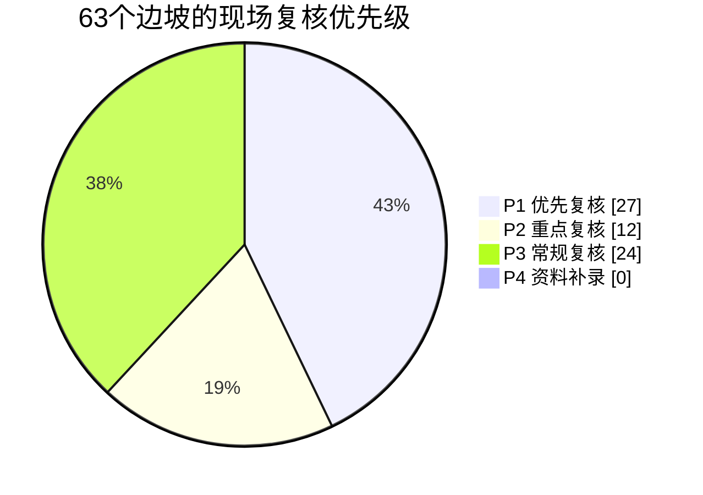
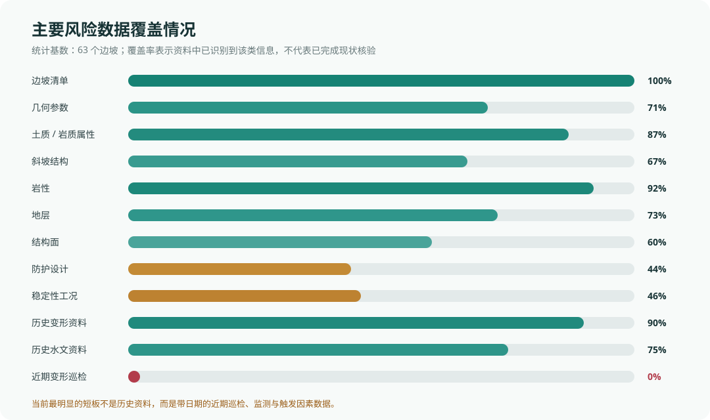
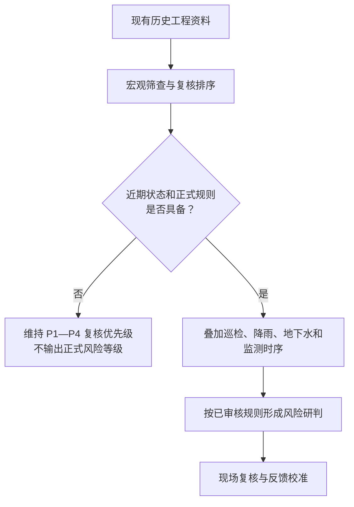

# SlopeKG 公路边坡风险预测阶段汇报

**汇报日期：** 2026年7月28日  
**汇报对象：** 交通部研究院  
**当前阶段：** 基于工程资料的宏观风险筛查与现场复核排序

**配套成果：** [风险研判单文件离线版](../output/demo/share/SlopeKG_风险研判_离线版.html)

## 一、当前结论

目前我们已经完成了从工程 PDF 自动解析、边坡信息抽取、知识图谱构建、规则资料整理到宏观风险筛查的基本闭环。

现阶段系统可以依据已有工程资料，对边坡形成一个偏保守、可追溯的宏观判断，并给出现场复核顺序、判断依据和建议补充的数据。这个结果适合用于交通部研究院提出的“先进行宏观模糊判断，再由人工现场复核”的工作方式。

需要特别说明的是，当前结果属于**资料驱动的风险筛查和复核排序**，还不是正式风险等级，也不是对具体失稳时间的预测。系统不会在缺少近期巡检、降雨、地下水和监测数据的情况下，给出“一定安全”“一定失稳”或者具体滑坡概率。

### 一图概览

这条流程已经可以自动运行；当前能力边界主要位于“候选规则审核”“近期动态数据接入”和“独立样本验证”三个环节。

## 二、目前已经形成的工作基础

### 1. PDF 自动解析

目前系统已接入 9 份工程 PDF，共计 651 页，可自动完成：

- PDF 上传、增量发现和后台解析；
- 原生文字、表格、扫描页和工程图纸的逐页分类；
- 原生文本优先、扫描页整页 OCR、图纸标题栏局部 OCR 等差异化策略；
- 边坡桩号、几何参数、岩性地层、结构面、防护工程、变形水文描述和稳定性工况抽取；
- 基础解析和可选的大模型深度解析；
- 原文页码、引句和证据位置保存。

系统的生产解析流程不依赖人工预先提供边坡清单。人工复核用于质量审计和结果确认，但不是每次解析的前置条件。

### 2. 边坡知识图谱

当前自动发现并建立了 63 个边坡对象，形成：

| 图谱指标 | 当前数量 |
|---|---:|
| 边坡 | 63 个 |
| 图谱节点 | 1,581 个 |
| 图谱关系 | 2,045 条 |
| 原文证据 | 592 条 |
| 防护工程节点 | 101 个 |
| 稳定性分析节点 | 76 个 |
| 结构面节点 | 252 个 |

图谱以边坡为核心，不把所有属性机械地建成独立实体。坡高、坡度、坡向等稳定描述保留为边坡属性；灾害体、结构面、防护工程、稳定性工况、历史变形和水文现象等具有独立身份或时效变化的内容建立为关联节点。

前端默认隐藏高频、次要的小节点，仅展示核心关系；需要时可以手动恢复全部节点。任何节点均未从图谱数据中删除。

### 3. 规则资料库

目前已对 15 份规范、标准和技术资料进行规则整理，形成：

| 规则库指标 | 当前数量 |
|---|---:|
| 候选条文 | 127 条 |
| 候选规则 | 164 条 |
| 风险引擎候选规则 | 51 条 |
| 阈值表 | 22 组 |
| 公式候选 | 2 个 |
| 具有完整证据的规则 | 155 条 |
| 已正式审核规则 | 0 条 |

这些规则目前仍处于候选状态。系统已经保存规则来源、PDF 页码和适用条件，但在交通部研究院完成业务审核前，不会将候选规则直接作为正式风险等级的计算依据。

## 三、当前风险筛查方式

目前风险筛查主要使用以下信息：

1. 是否登记滑坡、崩塌、危岩体、落石、路基垮塌等灾害或病害对象；
2. 坡高、坡度、坡体结构、岩性、地层和结构面；
3. 天然、现状、饱和、暴雨及治理设计等不同工况的稳定性结论；
4. 工程资料中记录的历史裂缝、崩塌、掉块、渗水等异常迹象；
5. 已有防护和设计防护资料；
6. 当前缺失的数据及其对判断准确度的影响。

系统将边坡划分为 P1 至 P4 四个复核优先级：

| 代码 | 当前含义 | 使用方式 |
|---|---|---|
| P1 | 优先复核 | 资料中存在较明确的不利稳定性结论或重要病害信息 |
| P2 | 重点复核 | 存在灾害体或不利因素，但当前信息不足以形成更明确判断 |
| P3 | 常规复核 | 已识别边坡和相关资料，按正常计划补充调查 |
| P4 | 资料补录 | 现有信息过少，需先补齐基本档案 |

P1 至 P4 表示的是**人工复核顺序**，不能直接等同于高、中、低风险等级。P3 也不能解释为安全，因为缺失数据不会按安全值处理。

## 四、当前筛查结果

最近一次自动筛查结果如下：

| 复核优先级 | 边坡数量 |
|---|---:|
| P1 优先复核 | 27 个 |
| P2 重点复核 | 12 个 |
| P3 常规复核 | 24 个 |
| P4 资料补录 | 0 个 |

63 个边坡中，有 29 个提取到稳定性计算资料，有 25 个在至少一个工况下出现原报告“欠稳定”结论；目前没有边坡具备输出正式风险等级所需的全部数据条件。

### 关于“欠稳定数量较多”的核查说明

我们已经对当前“欠稳定”结果反向核查到原始 PDF 页面。25 个存在欠稳定工况的边坡中：

- G209 路线 10 个；
- G318 路线 8 个；
- G351 路线 7 个。

按工况进一步区分：

- 11 个边坡在报告编制时的天然或现状工况下被评为欠稳定；
- 14 个边坡只在饱和、饱水或暴雨等不利假设工况下被评为欠稳定；
- 另外 2 个 P1 边坡没有稳定性计算结论，是因为工程资料将其登记为较重要的病害或不稳定对象。

因此，27 个 P1 不能解释为“当前有 27 个高风险边坡”，更不能解释为“27 个边坡即将失稳”。

欠稳定结果较多主要有两个原因：

1. 当前接入的工程资料本身以危岩体、灾害防治和病害调查为主，并不是普通公路边坡的随机样本，资料来源天然偏向问题边坡；
2. 当前规则采用偏保守策略，将天然/现状欠稳定和仅在饱和/暴雨工况下欠稳定都纳入了优先复核范围。

核查过程中还发现，部分相同稳定性工况同时被确定性解析和深度语义解析识别，造成详情中出现重复记录；个别大模型工况虽然数值正确，但展示时关联到了同页另一工况的证据句。这些问题不会改变“25 个边坡存在原报告欠稳定工况”的统计，但需要继续进行工况去重和逐工况证据绑定优化。

下一版建议将风险筛查进一步拆分为：

- **天然/报告现状欠稳定：** 优先复核；
- **仅饱和或暴雨工况欠稳定：** 条件性重点复核，并结合近期降雨和地下水判断是否升级；
- **仅有历史病害标签、缺少计算和近期状态：** 先进行现场核验；
- **出现近期持续变形或监测异常：** 提升复核和处置优先级。

## 五、当前数据完整度与质量

63 个边坡的平均风险数据完整度为 37.7%，正式风险研判就绪边坡为 0 个。

主要字段覆盖情况如下：

| 数据项 | 当前覆盖 |
|---|---:|
| 边坡清单 | 63/63，100% |
| 几何参数 | 45/63，71% |
| 土质/岩质属性 | 55/63，87% |
| 斜坡结构 | 42/63，67% |
| 岩性 | 58/63，92% |
| 地层 | 46/63，73% |
| 结构面 | 38/63，60% |
| 防护设计 | 28/63，44% |
| 稳定性工况 | 29/63，46% |
| 历史变形资料 | 57/63，90% |
| 历史水文资料 | 47/63，75% |
| 近期变形巡检 | 0/63，0% |

深度语义解析共处理 59 个边坡候选，52 个通过当前程序校验，通过率为 88.14%。系统保留了 410 条已核验原文引句。

这些指标反映的是自动发现、字段覆盖、证据一致性和图结构质量，不能直接理解为真实业务准确率达到 88.14%。真正的字段精确率、召回率、关系准确率和风险分级一致率，还需要使用交通部研究院确认的人工样本作为独立测试集进行评估。

## 六、当前能够提供的结果

现阶段系统可以提供：

- 面向 63 个边坡的宏观复核优先级；
- 每个边坡的命中依据、稳定性工况和 PDF 原文证据；
- 当前已具备和仍缺失的数据类别；
- 为提高风险判断准确度建议优先补充的数据；
- 防护、地质条件、灾害体和稳定性结果之间的图谱关系；
- 可单独发送、无需部署环境的离线 HTML 成果；
- 新增 PDF 后的自动解析、图谱更新和风险筛查更新。

现阶段不能提供：

- 具有正式业务效力的高、中、低风险等级；
- 具体失稳概率或具体失稳时间；
- “一定不会滑坡”或“一定会滑坡”的结论；
- 将历史勘察结论直接作为当前现场状态；
- 将设计防护方案直接视为已经施工且目前完好；
- 在缺少近期动态数据的情况下进行实时预警。

## 七、下一阶段需要交通部研究院确认或提供的内容

### 1. 风险规则和分级口径

需要确认：

- 宏观风险需要划分几级，各等级的名称和业务含义；
- P1 至 P4 是否继续作为复核顺序，还是需要映射为其他业务等级；
- 天然、现状、饱和、暴雨、地震等不同工况的使用方式；
- 稳定性系数、变形迹象、降雨、地下水和设施损坏的阈值；
- 多条规则同时命中时的优先级、否决项和升级条件；
- 规则的审核人、版本号、生效日期和废止方式。

### 2. 近期现场状态数据

为了从历史资料筛查提升为更可靠的当前风险研判，建议优先补充：

1. 带日期的近期现场巡检，包括裂缝、位移、掉块、滑塌、隆起、渗水和管涌；
2. 24 小时、72 小时和 7 日累计降雨；
3. 地下水位、渗水位置、孔压或地下水变化趋势；
4. 位移、裂缝宽度、倾角、GNSS 等监测时序；
5. 防护设施是否已经实施、当前完好程度和排水设施状态；
6. 养护、维修、清危和加固历史；
7. 交通量、人员、居民点及桥隧、管线等暴露对象。

### 3. 独立验证样本

建议由交通部研究院选取一批具有代表性的边坡，提供或确认：

- 正式边坡编号和边坡范围；
- 已审核的关键属性；
- 专家稳定性结论；
- 宏观风险或复核优先级；
- 判断所依据的现场资料和计算资料。

这批数据只用于独立评测和规则校准，不作为生产抽取的人工种子。建议覆盖危岩、滑坡、土质边坡、岩质边坡、已有防护、无防护、稳定、欠稳定以及资料缺失等不同情况。

## 八、下一步工作建议

下一阶段建议按照以下顺序推进：

1. 修正稳定性工况去重、逐工况证据绑定和报告时效标识；
2. 将天然/现状欠稳定与仅暴雨/饱和欠稳定分层展示；
3. 由交通部研究院审核候选风险规则和分级口径；
4. 接入近期巡检、降雨、地下水、防护现状和监测数据；
5. 建立独立人工测试集，计算字段精确率、召回率和风险判断一致率；
6. 根据现场复核结果形成“系统判断—现场结果—规则修正”的反馈闭环；
7. 在规则、数据和评测达到要求后，再逐步开放正式风险等级或动态预警能力。

## 九、阶段性判断

目前这套系统已经可以作为公路边坡工程资料自动建档、知识关联和宏观风险筛查工具使用，能够帮助从大量 PDF 中快速找到需要优先关注的边坡，并说明“为什么关注、证据在哪里、还缺什么数据”。

当前最重要的工作已经从“能否自动解析和建立图谱”，转向“如何确认风险规则、接入近期状态、建立验证标准”。只要完成规则审核、近期数据接入和独立样本验证，就可以在现有基础上逐步把宏观复核排序提升为更加稳定、可检验、可反馈的风险研判能力。

