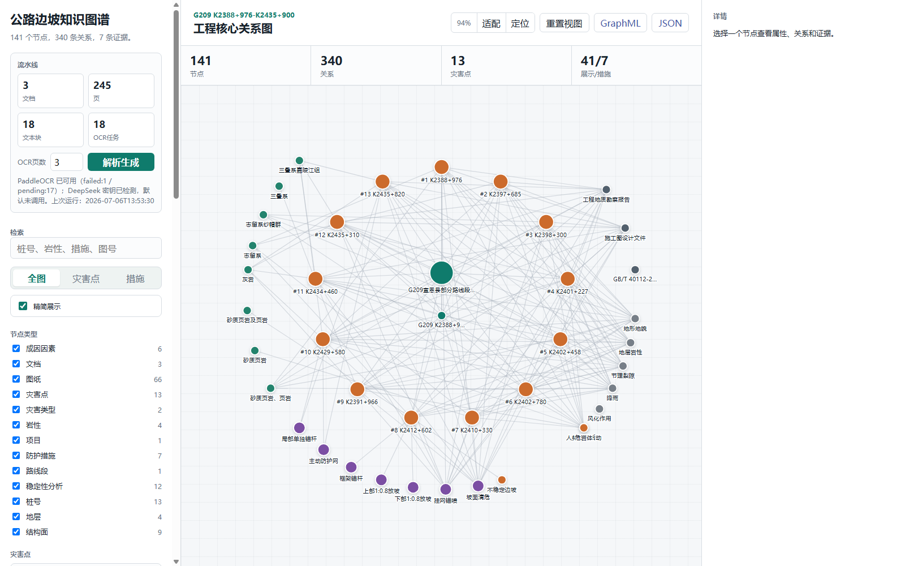
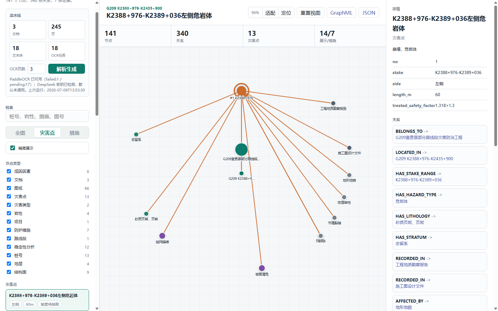
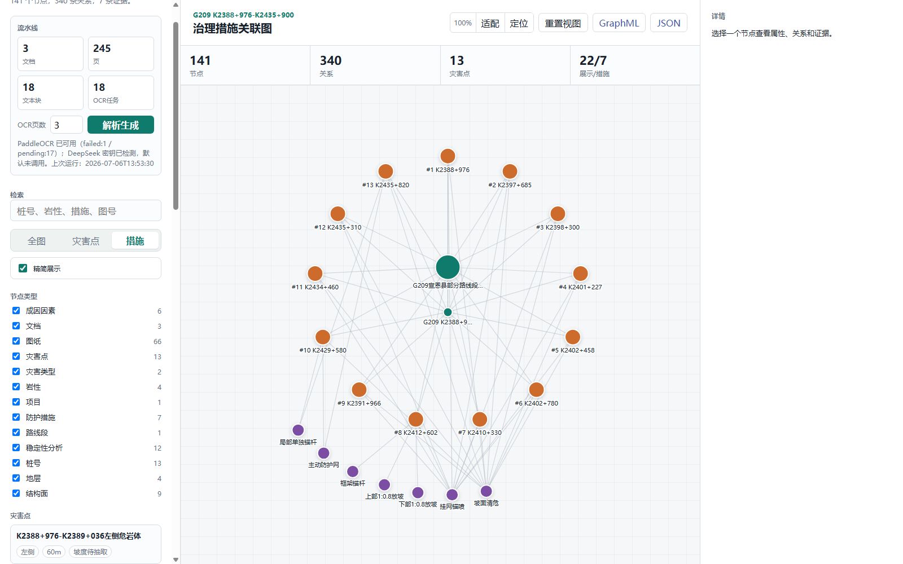

# 公路边坡知识图谱演示系统

> 版本提示：本文保留 v0.1 演示记录。当前实现已升级为边坡中心的多页面版本，最新入口与演示顺序见 `docs/demo_walkthrough.md`；本文中的单页界面、141个节点和340条关系为旧版口径。

## 系统概述

本系统面向公路边坡施工图设计、地质灾害防治与工程资料管理场景，将分散在设计文件、地质资料和规范文本中的关键信息进行统一组织，形成可浏览、可检索、可追溯的工程知识图谱。

本次展示以 **G209 K2388+976-K2435+900 路段公路边坡灾害防治工程资料包** 为样例，覆盖施工图设计文件、工程地质资料及相关规范文本。系统围绕灾害点、桩号范围、地层岩性、致灾因素、治理措施、设计图纸和证据来源建立关联，为工程资料的快速查阅和关联分析提供直观入口。

## 当前成果

| 内容 | 规模 |
| --- | ---: |
| 接入 PDF 资料 | 3 份 |
| 资料页数 | 245 页 |
| OCR 识别任务 | 18 项 |
| 图谱节点 | 141 个 |
| 图谱关系 | 340 条 |
| 灾害点 | 13 处 |
| 治理措施 | 7 类 |
| 证据记录 | 7 条 |

系统当前已组织项目、路线段、灾害点、灾害类型、桩号、岩性地层、致灾因素、治理措施、稳定性分析、图纸与文档等多类工程对象。页面默认采用“精简展示”模式，突出工程核心对象和关键关系；需要进一步查阅时，可通过类型筛选、关键词检索和节点详情进入全量信息。

## 系统界面

现场演示地址：

```text
http://127.0.0.1:8767/web/index.html
```

页面由三部分组成：左侧提供资料处理状态、检索与视图切换；中部呈现可缩放、拖动的知识图谱；右侧展示所选对象的属性、关联关系与证据来源。图谱支持鼠标滚轮缩放、按住空白区域拖动，以及一键适配和定位操作。

## 典型展示场景

### 工程核心关系总览

系统进入后，以工程资料包为中心展示项目、路线段、13 处灾害点、地质条件、致灾因素和治理措施之间的关键关联。不同颜色区分不同对象类型，便于快速把握工程范围、灾害分布与治理组织关系。



### 灾害点关联与证据追溯

选择任一灾害点后，系统自动聚焦其局部关系网络。右侧详情面板展示桩号、边坡侧别、长度和安全系数等属性，并列出关联的地质条件、致灾因素、治理措施、设计文件和证据记录。

以 K2388+976-K2389+036 左侧危岩体为例，可直接查看其与工程地质勘察报告、施工图设计文件、地层岩性及坡面清危等对象的关联。这种组织方式使工程问题、设计依据与处置措施可以在同一视图中追溯。



### 治理措施关联分析

切换至“措施”视图后，系统从治理方案角度展示各类防护措施与对应灾害点的关联。当前样例涵盖坡面清危、挂网锚喷、主动防护网、框架锚杆、局部单独锚杆及放坡等措施，可用于快速了解各灾害点的处置配置。



### 检索与资料定位

系统支持按桩号、岩性、措施名称和图号进行关键词检索，并可结合节点类型筛选缩小范围。选中节点后，可在详情面板查看关联对象及已挂接的 PDF 页码、图纸目录、OCR 片段或其他证据记录，为资料定位和复核提供依据。

## 资料处理与图谱构建

系统首先对 PDF 资料进行文档与页面解析，保留页码、文本块和 OCR 任务等处理结果；随后将工程资料中的灾害点、地质条件、设计措施、图纸编号等信息按照统一的数据模型组织为实体与关系，并为关键对象挂接来源证据。

当前版本已形成从资料解析、OCR 任务管理、图谱生成到前端交互展示的完整链路。后续可在现有基础上继续增强表格自动抽取、图纸标题栏与标注识别、证据区域定位、语义检索和多项目管理能力。
